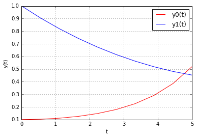
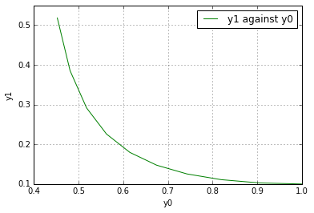
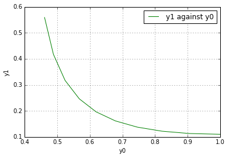

UECM3033 Assignment #3 Report
========================================================

- Prepared by: Tham Kien Yang
- Tutorial Group: T3

--------------------------------------------------------

## Task 1 --  Gauss-Legendre formula

The reports, codes and supporting documents are to be uploaded to Github at: 

[https://github.com/ThamKienYang/UECM3033_assign3](https://github.com/ThamKienYang/UECM3033_assign3)

Explain how you implement your `task1.py` here.

First, the value of the weights and nodes are calculated using the Gauss-Legendre function in python. Then, the answer is calculated using the formula for Gauss-Legendre Quadrature. Lastly, the answer is shown in task1.py

Explain how you get the weights and nodes used in the Gauss-Legendre quadrature.

To get the value of weights and nodes, i use the legendre module in numpy. The  code for Gauss-Legendre quadrature in python that i found was np.polynomial.legendre.leggauss.

---------------------------------------------------------

## Task 2 -- Predator-prey model

Explain how you implement your `task2.py` here, especially how to use `odeint`.

First, the function for the system of ODE is created with the differential equations. Then, another function for solving the system of ODE and plotting graph. In this function, the code for odeint is used with the function for system of ODE, initial condition y0, time sequence t as parameter. Then, extra arguments such as a and b are passed to function. Lastly, the two graph for y0 and y1 against t, and y1 against y0 are plotted. Then another two similar graph with initial condition of 0.11 are plotted.

Put your graphs here and explain.

The two graph below is the graph of the solution for ODE system with scipy.integrate.odeint with y0(0) equal to 0.1. 

The two graph below is the graph of the solution for ODE system with scipy.integrate.odeint with y0(0) equal to 0.11.

Is the system of ODE sensitive to initial condition? Explain.

The system of ODE is considered sensitive to initial condition. As seen in the four graph above, the graph become a bit different as the initial condition changed from 0.1 to 0.11.

-----------------------------------

last modified: 16/04/2016
